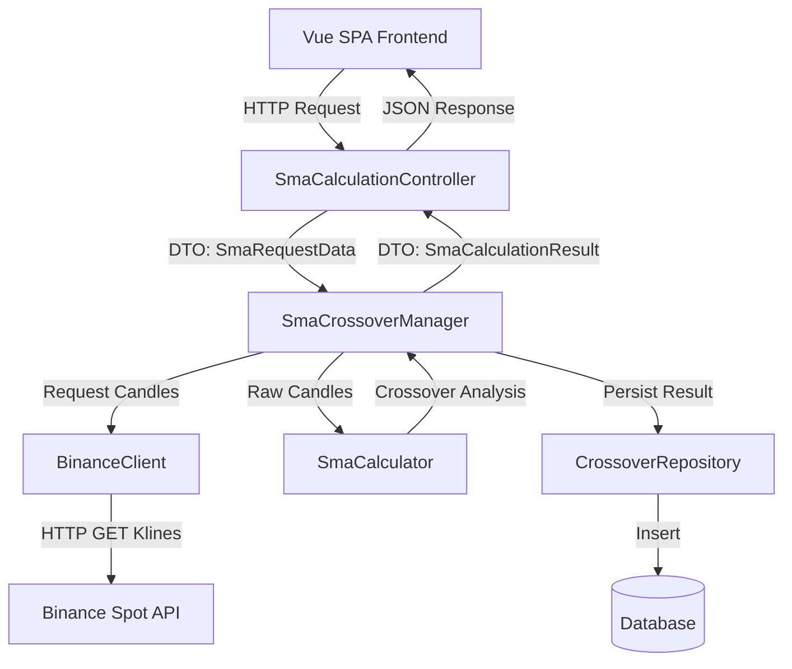

# Especificación Técnica (SDD): Binance SMA Crossover SPA

Este documento contiene las especificaciones técnicas detalladas, diseño de arquitectura, estructura de base de datos e historias de usuario para el desarrollo de la aplicación SPA de cálculo de cruces de medias móviles simples (SMA).

---

## 1. Historias de Usuario (User Stories)

### US-1: Formulario de Configuración de Consulta
**Como** usuario de la aplicación,
**Quiero** ingresar los parámetros de la consulta a través de un formulario intuitivo,
**Para** poder calcular los cruces de SMA en base a mi criterio de análisis.

*   **Criterios de Aceptación:**
    1.  El formulario debe permitir seleccionar el mercado entre un listado cerrado: `BTCUSDT`, `ETHUSDT`, `XRPUSDT`.
    2.  Debe permitir seleccionar el intervalo de tiempo: `1m`, `3m`, `5m`, `15m`, `30m`, `1h`, `2h`, `4h`, `6h`, `8h`, `12h`, `1d`, `3d`, `1w`.
    3.  Debe permitir ingresar un rango de fechas con hora específica (Desde y Hasta).
    4.  Debe permitir configurar la longitud de periodo para las dos SMA (SMA Corto y SMA Largo), validando que ambos sean números enteros positivos y que el periodo corto sea estrictamente menor que el largo.
    5.  El formulario debe validar que el rango de fechas no supere los límites de paginación para proteger la API (ver límites en Sección 2).
    6.  El formulario debe estar traducido al idioma seleccionado (Español / Inglés).

### US-2: Cálculo y Visualización de Cruces
**Como** usuario de la aplicación,
**Quiero** ver los resultados del cálculo en pantalla tras enviar el formulario,
**Para** conocer la cantidad de cruces ocurridos, su fecha/hora y si fueron ascendentes o descendentes.

*   **Criterios de Aceptación:**
    1.  Al enviar el formulario, la aplicación debe mostrar un indicador de carga mientras procesa.
    2.  Se debe mostrar la cantidad total de cruces detectados.
    3.  Se debe listar cada cruce con su respectiva Fecha y Hora formateada en la zona horaria local del usuario.
    4.  Cada cruce debe indicar su dirección: **Ascendente (Golden Cross)** si el SMA de menor longitud cruza por encima del de mayor longitud, o **Descendente (Death Cross)** si cruza por debajo.
    5.  No es necesario graficar visualmente los precios ni los cruces (observación explícita del cliente).

### US-3: Historial de Consultas
**Como** usuario de la aplicación,
**Quiero** ver un registro de las búsquedas y cálculos realizados con anterioridad,
**Para** tener un histórico de mis análisis y poder consultarlos rápidamente sin volver a llamar a la API de Binance.

*   **Criterios de Aceptación:**
    1.  Cada cálculo exitoso debe registrarse automáticamente en la base de datos local.
    2.  La SPA debe contar con una sección o pestaña de "Historial".
    3.  El historial debe listar las consultas previas mostrando: mercado, intervalo, rango de fechas, periodos de SMA, cantidad de cruces detectados y la fecha de creación del reporte.
    4.  Debe ser posible hacer clic en un registro del historial para ver el detalle de los cruces asociados a esa consulta.

### US-4: Internacionalización (i18n)
**Como** usuario internacional,
**Quiero** cambiar el idioma de la interfaz web,
**Para** poder operar la herramienta en mi idioma nativo.

*   **Criterios de Aceptación:**
    1.  La SPA debe ofrecer un selector de idioma visible en la cabecera (Español / Inglés).
    2.  Al cambiar el idioma, todas las etiquetas del formulario, mensajes de validación, cabeceras de tablas y textos informativos deben traducirse instantáneamente sin recargar la página.

---

## 2. Arquitectura de Software (Backend - Laravel)

Para cumplir con los principios **SOLID**, la **testabilidad** y la **mantenibilidad**, desacoplaremos completamente la infraestructura (llamadas HTTP a Binance) de la lógica de negocio (cálculo de SMA y cruces).

### Componentes Principales:

1.  **`App\DTO\SmaRequestData`**:
    Clase de transferencia de datos que valida y almacena los parámetros limpios de la consulta. Convierte las fechas recibidas (en hora local del cliente) a objetos `Carbon` en UTC para uso interno.
2.  **`App\Services\Binance\BinanceClientInterface`**:
    Interfaz que define el contrato para obtener datos históricos. Esto permite mockear la API de Binance de forma limpia en los tests.
    *   `public function getKlines(string $symbol, string $interval, Carbon $startTime, Carbon $endTime): array;`
3.  **`App\Services\Binance\BinanceClient`**:
    Implementación concreta de la interfaz anterior. Utiliza `Http` client de Laravel para comunicarse con la API pública de Binance (`https://api.binance.com/api/v3/klines`).
    *   *Manejo de Paginación:* Si el rango de tiempo excede el límite de 1000 velas en una sola llamada, realiza llamadas iterativas paginadas utilizando el parámetro `startTime`.
4.  **`App\Services\Math\SmaCalculatorInterface`**:
    Interfaz para la lógica matemática, abstrayendo el cálculo para permitir futuros cambios de algoritmo.
5.  **`App\Services\Math\SmaCalculator`**:
    Clase de lógica pura (Pure Business Logic) encargada de:
    *   Calcular el SMA para una longitud dada: $SMA_t = \frac{\sum_{i=0}^{n-1} Close_{t-i}}{n}$
    *   Analizar las series temporales de ambos SMA para identificar cruces. Un cruce ocurre en el índice $t$ si:
        *   **Cruce Ascendente:** $SMA_{corto, t-1} \le SMA_{largo, t-1}$ y $SMA_{corto, t} > SMA_{largo, t}$.
        *   **Cruce Descendente:** $SMA_{corto, t-1} \ge SMA_{largo, t-1}$ y $SMA_{corto, t} < SMA_{largo, t}$.
6.  **`App\Actions\CalculateAndStoreCrossoversAction`**:
    Clase de caso de uso (Use Case) u orquestador. Coordina el flujo:
    1. Llama al `BinanceClient` para obtener las velas requeridas.
    2. Envía las velas a `SmaCalculator` para computar los SMA y detectar los cruces.
    3. Registra la consulta y los cruces en la base de datos a través de Eloquent.
    4. Retorna un DTO `SmaCalculationResult`.

---

## 3. Diseño de Base de Datos

Utilizaremos dos tablas relacionadas en una relación de uno a muchos (One-to-Many):

### Tabla: `sma_queries` (Historial de consultas)
Almacena los parámetros de búsqueda y el resumen del cálculo.
*   `id` (BIGINT, Primary Key, Auto-increment)
*   `market` (VARCHAR - ej: "BTCUSDT")
*   `interval` (VARCHAR - ej: "30m")
*   `start_date` (DATETIME, guardado en UTC)
*   `end_date` (DATETIME, guardado en UTC)
*   `short_period` (INT)
*   `long_period` (INT)
*   `crossovers_count` (INT)
*   `created_at` / `updated_at` (TIMESTAMP)

### Tabla: `sma_crossovers` (Detalles de los cruces)
Almacena cada uno de los cruces específicos detectados en una consulta.
*   `id` (BIGINT, Primary Key, Auto-increment)
*   `sma_query_id` (FOREIGN KEY ref `sma_queries.id` ON DELETE CASCADE)
*   `crossover_time` (DATETIME, guardado en UTC - representa el tiempo de la vela en la que ocurrió el cruce)
*   `direction` (ENUM: 'ascending', 'descending')
*   `short_sma_value` (DECIMAL(20, 8))
*   `long_sma_value` (DECIMAL(20, 8))
*   `price_at_crossover` (DECIMAL(20, 8))

---

## 4. Estrategia de Paginación y Límites de Rango (Adaptativo)

Para garantizar un tiempo de respuesta rápido y evitar bloqueos por parte de Binance (Rate Limit), se aplicará la siguiente matriz de límites de rango de fecha máximo:

| Intervalo | Equivalente en minutos | Rango Máximo Permitido | Cantidad Máx. Velas Estimadas |
| :--- | :--- | :--- | :--- |
| **1m** | 1 min | 7 días | 10,080 |
| **3m** | 3 min | 7 días | 3,360 |
| **5m** | 5 min | 14 días | 4,032 |
| **15m** | 15 min | 30 días | 2,880 |
| **30m** | 30 min | 60 días | 2,880 |
| **1h** | 60 min | 6 meses | 4,380 |
| **2h** | 120 min | 6 meses | 2,190 |
| **4h** | 240 min | 1 año | 2,190 |
| **6h / 8h / 12h**| - | 1 año | 1,460 / 1,095 / 730 |
| **1d / 3d / 1w** | - | 3 años | 1,095 / 365 / 156 |

*Las validaciones de estos límites se realizarán tanto en el Frontend (interfaz de usuario reactiva) como en el Backend (Laravel Request Validation).*

---

## 5. Estrategia Frontend (Vue 3 SPA)

*   **Tecnologías:** Vue 3 (Composition API) + Tailwind CSS v4 para el estilo.
*   **Zona Horaria del Navegador (i18n & UX):**
    *   La SPA detectará automáticamente la zona horaria del usuario mediante `Intl.DateTimeFormat().resolvedOptions().timeZone`.
    *   Las fechas se mostrarán utilizando librerías nativas de JavaScript o `date-fns` / `luxon` formateadas en la hora local del usuario para su fácil lectura.
*   **i18n Localización:**
    *   Se creará un archivo de traducción para Español (`es.json`) y otro para Inglés (`en.json`).
    *   El estado del idioma seleccionado se mantendrá en `localStorage` para preservar la elección al recargar.

---

## 6. Estrategia de Testing (Pest PHP)

Para garantizar el correcto funcionamiento del software sin depender de recursos externos:

1.  **Unit Tests (Matemáticas y Algoritmos):**
    *   Se creará un conjunto de pruebas unitarias específicas para la clase `SmaCalculator`.
    *   Se proveerá un arreglo estático de precios y se verificará que las medias móviles y la dirección del cruce coincidan exactamente con cálculos manuales predecibles.
2.  **Mocking de API (Pruebas de Integración):**
    *   Usando `Http::fake()` de Laravel, interceptaremos las llamadas a la API de Binance.
    *   Se simularán respuestas exitosas con velas mockeadas y respuestas de error (ej: error 400 por símbolo inválido) para validar el comportamiento resiliente del backend.
3.  **Test de Aceptación del Caso del PDF:**
    *   Se programará un test de integración que replique exactamente la consulta del ejemplo: `BTCUSDT`, del `21-10-2024 00:00` al `26-10-2024 23:59`, con SMA 50 y SMA 200, intervalo `30m`.
    *   El test verifique que se encuentren exactamente los 2 cruces correspondientes a las fechas del ejemplo.

---

## 7. Estrategia de Control de Versiones y Gestión de Commits

Para asegurar la trazabilidad del código, la modularidad y el cumplimiento de estándares de nivel profesional, el proyecto seguirá la siguiente política de Git y Pull Requests.

### 7.1. Modelo de Ramas (Branching Model)
El desarrollo se basará en ramas cortas derivadas de la rama base `main`.
*   **Rama Base**: `main` (código en producción estable).
*   **Ramas de Desarrollo (Feature Branches)**:
    *   `feature/US-[N]-[descripción]` para nuevas funcionalidades (ej: `feature/US-1-sma-form`).
    *   `fix/[descripción]` para corrección de bugs (ej: `fix/binance-timezone-offset`).
    *   `docs/[descripción]` para actualizaciones de documentación (ej: `docs/git-strategy`).
    *   `test/[descripción]` para incorporación o mantenimiento de pruebas (ej: `test/sma-calculator`).

### 7.2. Convención de Commits (Conventional Commits)
Los mensajes de confirmación de cambios (commits) deben estructurarse de la siguiente manera:
`<tipo>(<alcance>): <descripción corta en imperativo>`

*   **Tipos Permitidos**:
    *   `feat`: Nueva funcionalidad (mapeado a historias de usuario).
    *   `fix`: Solución a un error de ejecución o lógica.
    *   `docs`: Cambios exclusivos en archivos de documentación.
    *   `test`: Añadir o corregir pruebas unitarias, de integración o configuración de Pest.
    *   `refactor`: Cambios de código que no corrigen errores ni añaden funcionalidad (ej: cambiar nombres de variables, reestructurar una clase).
    *   `chore`: Tareas de configuración general del proyecto (ej: instalación de dependencias, scripts de construcción Vite).
*   **Ejemplos**:
    *   `feat(backend): agregar cliente binance con paginación`
    *   `test(math): escribir pruebas unitarias para SmaCalculator`
    *   `fix(db): cambiar tipo de columna short_sma_value a decimal`
    *   `docs(sdd): documentar estrategia de git y commits`

### 7.3. Flujo para Creación de Pull Requests (PR)
1.  Crear una rama local con el formato correspondiente (`git checkout -b feature/US-1-sma-form`).
2.  Desarrollar la funcionalidad siguiendo el método SDD.
3.  Asegurar que todas las pruebas locales pasen (`php artisan test`) y que no haya errores sintácticos.
4.  Realizar commits incrementales utilizando Conventional Commits.
5.  Subir la rama al repositorio remoto y abrir un Pull Request hacia la rama `main`.
6.  **Estructura del Pull Request**:
    *   **Título**: Siguiendo la misma estructura de conventional commits (ej: `feat(frontend): diseñar formulario reactivo de consulta`).
    *   **Descripción**: Resumen claro de qué cambia, cómo se prueba y capturas de pantalla/terminal que demuestren que funciona.

